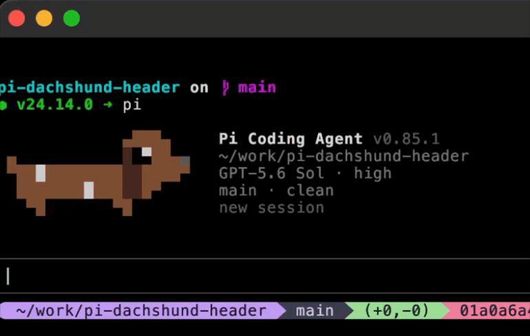

# Dachshund Header for pi

A tail-wagging dachshund startup header for pi. Or bring your own pet!



## Install

```bash
pi install npm:pi-dachshund-header
```

Or straight from GitHub:

```bash
pi install git:github.com/gaborvecsei/pi-dachshund-header
```

### Remove

To go back to the built-in header, `pi remove npm:pi-dachshund-header`.

## Bring your own pet

Pets are plain text files you can draw yourself. See [pets/README.md](pets/README.md) for the format and where to put them.

## Notes

- Pets are drawn with 24-bit colors, so they look best in a truecolor terminal.
